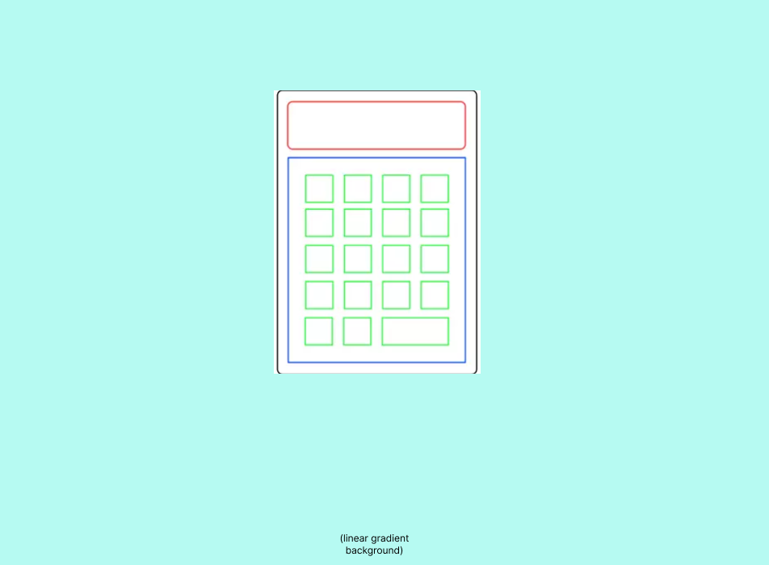
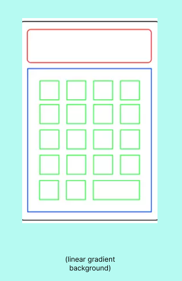
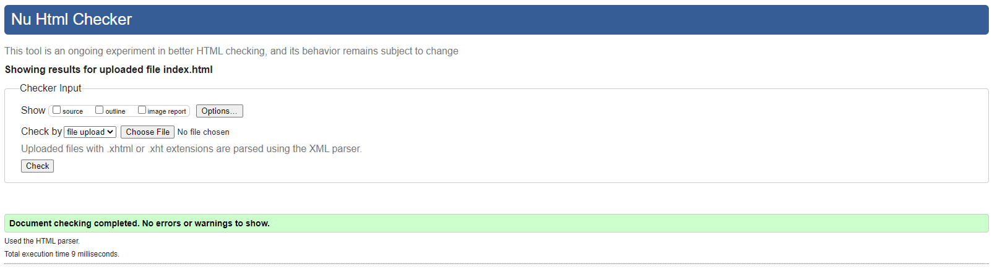
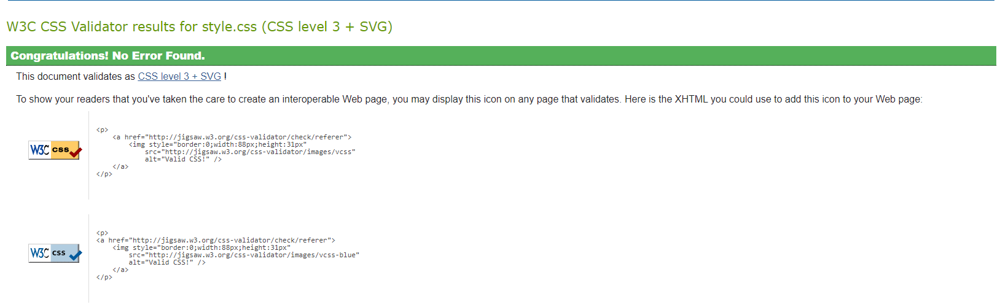
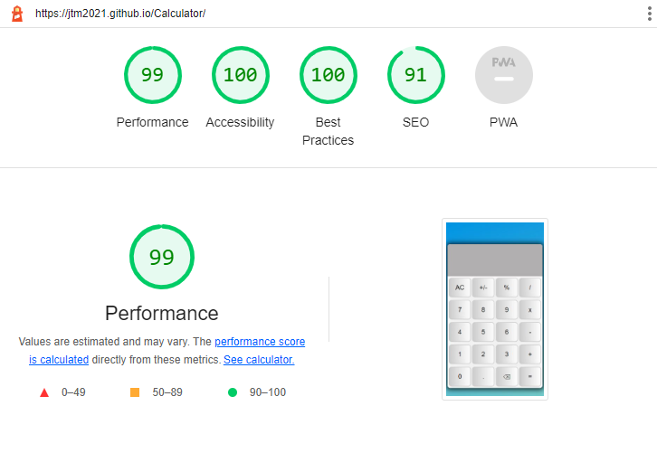
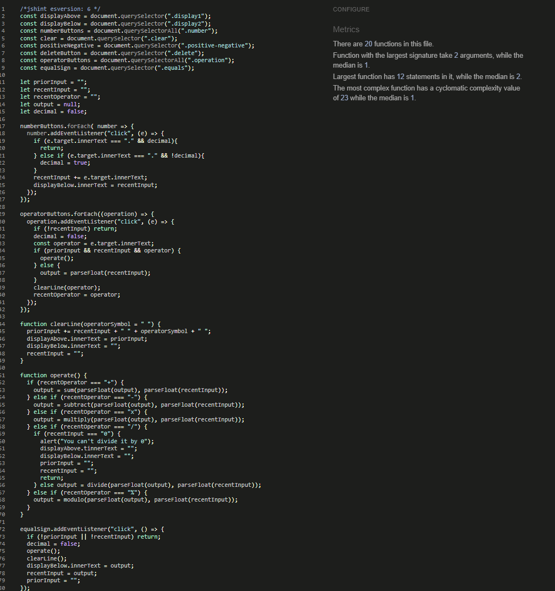

# Calculator

This calculator app is part of the projects required during the BRAINNEST Front-End Development Program. It has the basic functionalities of a calculator. 

Live Link:
https://jtm2021.github.io/Calculator/

 

## Keyboard Functionality
This calculator app has an added keyboard functionality that allows users to use the keyboard when using the calculator
    
IMPORTANT INSTRUCTIONS:

`0` `1` `2` `3` `4` `5` `6` `7` `8` `9` - users can use the number keys for the operands
 
`+` `-` `*` `/` - regular mathematical symbols for the operators
 
`%` - this represents the modulo operator and doesn't represent percentage
 
`enter` / `=` - can be used to calculate the mathematical expression
 
`.` - can be used for adding a decimal point to a number
 
`Backspace` - use to delete recent number input
 
`Escape key` / `Delete Key` - use to clear whole calculator output display
 
`n` - use this to indicate a number to be of negative value

 

## Handling Calculation Issues
- Users can input a decimal point but the code prevent users to input more than one decimal point at a time.

- The negative symbol is deactivated when the display is empty or with zero value. Users can only convert a value to negative once there is a valid number input other than zero.

- Using backspace key deletes recent input. If number input is empty, pressing the backspace again will eventually delete previous calculations and clears the whole calculator output display.

    

## Wireframes
The wireframe for this project were made digitally using [**Figma**](https://www.figma.com/).

Click To See Wireframes

### Big Screens (Laptops)

### Medium Sized Screens (Tablets)

### Small Screen Devices (Phones)

 

## Validator Testing ##
- HTML - No errors were returned when passing through the official [**W3C validator**](https://validator.w3.org)
    - HTML file
        

- CSS - No errors were found when passing through the official [**(Jigsaw) validator**](https://jigsaw.w3.org/css-validator)
    - 

- Lighthouse - I've tested the performance of the page using Google Chrome Lighthouse.
    - 

- Javascript - No errors were found when passing through the javascript code quality tool [**JSHint**](https://jshint.com/)
    - 

 

## Deployment 
The site was deployed to GitHub pages. The steps to deploy are as follows:

- Open a web browser (like Chrome, Firefox or Edge)
- Login to Github and locate repositories.
- In the GitHub repository, navigate to the Settings tab.
- Go to pages tab and from the source section drop-down menu, select the main Branch and then click save button.
- Once the main branch has been selected and saved, the page provided a link the completed website. 

The live link can be found here - https://jtm2021.github.io/Calculator/